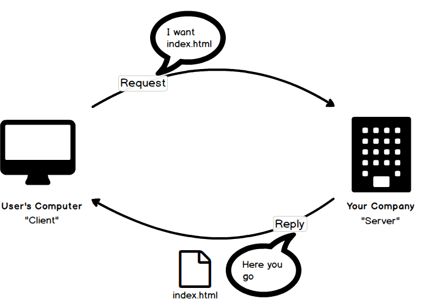

**Learning Objectives**
=======================
- "Hello World" with ASP.NET MVC
- Learn what a "server" is and what role it plays in a web application
- Start working with MVC "views" to create HTML pages

**Outline**
===========
- In Class Demo - Hello World
  - Create the project using the ASP.NET Web Application template with MVC
  - Add a "HelloWorld" action to the "HomeController" and a "HelloWorld" view to the home folder
- HTTP crash course - servers, clients, and HTTP requests
  - In the HTML 5 Web Apps course we learned how to create UI using HTML, CSS, and js
  - Your whole app relied on .html, .css, and .js files to run
  - When you want other people to use your app - how do you get the files to them?

  - This is where a **server** comes into play - a **server** is a place to store all the source files for your app so your users can download them when they want to
  - In other words, it **serves** your content on request

  - On the other side, the end user getting to your app is called the **client**
  - The client makes a **request** to the server for your web app; the server finds the appropriate file and sends it back in a **response** to the client

  - Pay attention to all the words in bold - they come up a lot in MVC

- In Class Demo - Using Postman
  - Download Postman from https://www.getpostman.com/
  - Use Postman to create HTTP requests manually - this allows you to customize every aspect of the request easily
  - GET the HelloWorld file from our MVC server
  - GET a physical file from the old HTML 5 Web Apps server
  - Try to GET a file that doesn't exist
- The MVC Framework
  - In this course, we'll be using ASP.NET MVC - a framework developed by Microsoft for web servers
  - You don't need to be an expert in MVC to use it; we'll cover all the main parts you need to know in class
  - For the curious - MVC = **M**odel, **V**iew, **C**ontroller.  It has some overlap conceptually with controllers from angular
- MVC Views
  - A "view" in MVC is a template for an HTML page in your web app
  - MVC lets you use C# code _directly in your HTML_ using a special markup called "Razor"
  - Store the view files in the "Views" folder in your project; Names between the controller and view folder must match
  - Razor syntax
    - Use @ before C# code; the compiler can automatically "match" opening and closing statements / braces so you don't always need an @
    - Also use @ to revert to HTML in the middle of C# code
- In Class Demo - "Your Computer" Info
- Sending data to the view
  - You can _technically_ put all the code you need to generate your view in your Razor markup
  - BUT... this breaks separation of concerns
  - We want to separate
    - Code to generate a **view** of the data - this is HTML w/ inline C# via razor
    - Code to update databases, check user info, read data, etc - this is the **controller** 
    - A **model** which stores all the information the view will need
  - In other words - the **controller** creates a **model** which gets sent to the **view**
  - To start with - send data to the view with the _ViewBag_
  - For more complex views, use _strong typing_
- In Class Demo - "About YY Kosbie" - In a "real" app this would be a flexible view which would read from a DB
  - The **model** goes to the **view** w/ our test data
  - We add a "strong typed" model to the view; the "Model" prop gets intellisense etc
- HTTP Verbs
  - Every request has a "verb" or "method" with it;
  - GET - read data; shouldn't make any changes to the DB
  - POST - send new data; can either be an edit, create, or delete on the DB
  - Many other verbs exist, we'll revisit them later
- In Class Demo - Rapid Dev Contact Manager
  - Use pre-fab views from VS templates to perform CRUD ops
  - Use Postman to simulate create and edit ops